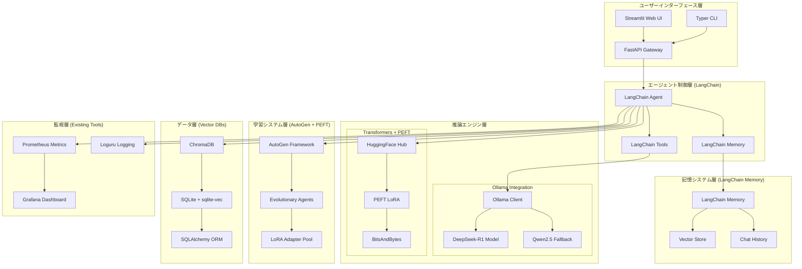
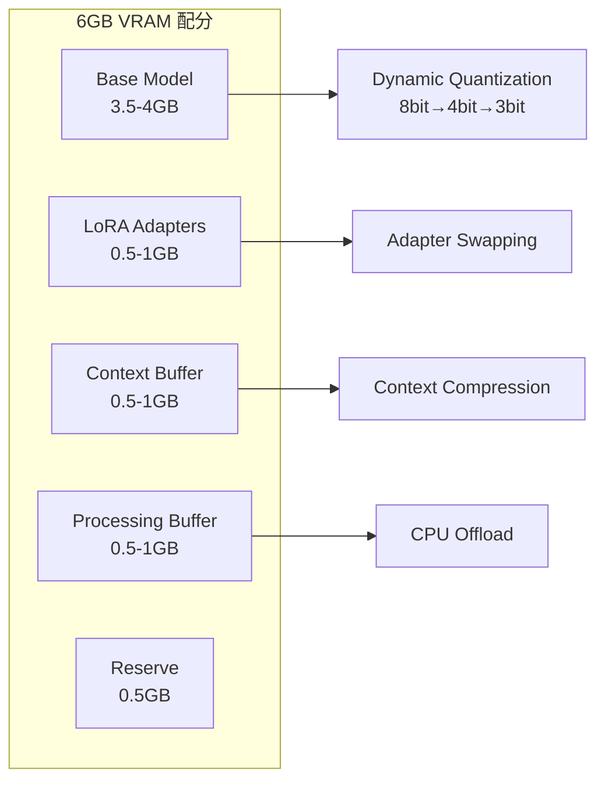

# 設計書

## 概要

RTX 4050 Laptop GPU (6GB VRAM) + Intel i7-13700H + 32GB RAM 環境で動作する高性能自己学習 AI エージェントシステムを設計します。**オープンソースライブラリを最大限活用**し、オリジナルコードを最小限に抑えて、既存の成熟したソリューションを統合することで開発効率と安定性を向上させます。

## アーキテクチャ

### オープンソース統合アーキテクチャ



### GPU メモリ管理戦略



## コンポーネントと インターフェース

### 1. LangChain + Ollama 統合推論エンジン

```python
from langchain_community.llms import Ollama
from langchain.agents import AgentExecutor, create_react_agent
from langchain.memory import ConversationBufferWindowMemory
from langchain_community.vectorstores import Chroma
from langchain.tools import Tool

class OllamaReasoningEngine:
    """Ollama + LangChain ベース推論エンジン"""

    def __init__(self,
                 model_name: str = "deepseek-r1:7b",
                 fallback_model: str = "qwen2.5:7b-instruct-q4_k_m",
                 base_url: str = "http://localhost:11434"):
        # Ollama LLM インスタンス（LangChain統合）
        self.primary_llm = Ollama(
            model=model_name,
            base_url=base_url,
            temperature=0.1
        )
        self.fallback_llm = Ollama(
            model=fallback_model,
            base_url=base_url,
            temperature=0.1
        )

        # LangChain Memory（永続化対応）
        self.memory = ConversationBufferWindowMemory(
            k=50,  # 直近50回の会話を保持
            return_messages=True,
            memory_key="chat_history"
        )

        # Vector Store（ChromaDB使用）
        self.vector_store = Chroma(
            persist_directory="./data/chroma_db",
            embedding_function=self._get_embedding_function()
        )

    async def reasoning_inference(self,
                                prompt: str,
                                use_cot: bool = True) -> dict:
        """LangChain Agent による推論実行"""
        try:
            # ReAct Agent で Chain-of-Thought 推論
            agent = create_react_agent(
                llm=self.primary_llm,
                tools=self._get_tools(),
                prompt=self._get_cot_prompt() if use_cot else self._get_basic_prompt()
            )

            agent_executor = AgentExecutor(
                agent=agent,
                tools=self._get_tools(),
                memory=self.memory,
                verbose=True,
                max_iterations=5
            )

            result = await agent_executor.ainvoke({"input": prompt})
            return result

        except Exception as e:
            # フォールバックモデルで再試行
            return await self._fallback_inference(prompt)

    def _get_tools(self) -> list[Tool]:
        """LangChain Tools の定義"""
        return [
            Tool(
                name="memory_search",
                description="過去の会話や学習内容を検索",
                func=self._search_memory
            ),
            Tool(
                name="gpu_monitor",
                description="GPU使用状況の監視",
                func=self._monitor_gpu
            )
        ]
```

### 2. AutoGen + PEFT 進化的学習システム

```python
from autogen import AssistantAgent, UserProxyAgent, GroupChat, GroupChatManager
from peft import LoraConfig, get_peft_model, TaskType
from transformers import AutoModelForCausalLM, AutoTokenizer
import torch

class AutoGenEvolutionarySystem:
    """AutoGen + PEFT による進化的学習システム"""

    def __init__(self,
                 base_model_name: str = "microsoft/DialoGPT-medium",
                 adapter_pool_size: int = 10):

        # AutoGen エージェント設定
        self.config_list = [{
            "model": "deepseek-r1:7b",
            "base_url": "http://localhost:11434/v1",
            "api_key": "ollama"
        }]

        # 進化的学習用エージェント群
        self.evolution_agents = self._create_evolution_agents()

        # PEFT設定（HuggingFace PEFT使用）
        self.lora_config = LoraConfig(
            task_type=TaskType.CAUSAL_LM,
            inference_mode=False,
            r=16,  # LoRA rank
            lora_alpha=32,
            lora_dropout=0.1,
            target_modules=["q_proj", "v_proj", "k_proj", "o_proj"]
        )

        # アダプタプール（PEFT管理）
        self.adapter_pool = {}
        self.performance_scores = {}

    def _create_evolution_agents(self) -> dict:
        """AutoGen エージェント群の作成"""

        # 評価エージェント
        evaluator = AssistantAgent(
            name="evaluator",
            llm_config={"config_list": self.config_list},
            system_message="あなたは AI モデルの性能を評価する専門家です。"
        )

        # 改善提案エージェント
        improver = AssistantAgent(
            name="improver",
            llm_config={"config_list": self.config_list},
            system_message="あなたは AI モデルの改善案を提案する専門家です。"
        )

        # 統合管理エージェント
        manager = GroupChatManager(
            groupchat=GroupChat(
                agents=[evaluator, improver],
                messages=[],
                max_round=10
            ),
            llm_config={"config_list": self.config_list}
        )

        return {
            "evaluator": evaluator,
            "improver": improver,
            "manager": manager
        }

    async def evolve_adapters(self, task_results: list) -> dict:
        """PEFT アダプタの進化的改善"""

        # 1. 性能評価（AutoGen エージェントによる）
        evaluation_prompt = f"""
        以下のタスク結果を分析し、改善点を特定してください：
        {task_results}
        """

        evaluation = await self.evolution_agents["evaluator"].a_generate_reply(
            messages=[{"content": evaluation_prompt, "role": "user"}]
        )

        # 2. 改善案生成
        improvement_prompt = f"""
        評価結果: {evaluation}
        この評価に基づいて、LoRAアダプタの改善案を提案してください。
        """

        improvements = await self.evolution_agents["improver"].a_generate_reply(
            messages=[{"content": improvement_prompt, "role": "user"}]
        )

        # 3. PEFT による実際のアダプタ更新
        return await self._apply_peft_improvements(improvements)

    async def _apply_peft_improvements(self, improvements: str) -> dict:
        """PEFT ライブラリを使用したアダプタ改善の適用"""

        # HuggingFace Transformers + PEFT による実装
        base_model = AutoModelForCausalLM.from_pretrained(
            "microsoft/DialoGPT-medium",
            torch_dtype=torch.float16,
            device_map="auto"
        )

        # LoRA アダプタの適用
        peft_model = get_peft_model(base_model, self.lora_config)

        # 改善案に基づくファインチューニング（簡略化）
        # 実際の実装では、改善案をパラメータ調整に変換

        return {
            "model": peft_model,
            "improvements": improvements,
            "config": self.lora_config
        }
```

### 3. PSUtil + NVIDIA-ML メモリ管理システム

```python
import psutil
import pynvml
from accelerate import Accelerator
from transformers import BitsAndBytesConfig
import torch

class SystemMemoryManager:
    """PSUtil + NVIDIA-ML による統合メモリ管理"""

    def __init__(self, max_vram_gb: float = 5.0):
        self.max_vram_gb = max_vram_gb

        # NVIDIA-ML 初期化
        pynvml.nvmlInit()
        self.gpu_handle = pynvml.nvmlDeviceGetHandleByIndex(0)

        # HuggingFace Accelerate 初期化
        self.accelerator = Accelerator()

        # BitsAndBytes 量子化設定
        self.quantization_config = BitsAndBytesConfig(
            load_in_4bit=True,
            bnb_4bit_compute_dtype=torch.float16,
            bnb_4bit_use_double_quant=True,
            bnb_4bit_quant_type="nf4"
        )

    def get_memory_stats(self) -> dict:
        """システム全体のメモリ統計（PSUtil + NVIDIA-ML）"""

        # CPU メモリ（PSUtil）
        cpu_memory = psutil.virtual_memory()

        # GPU メモリ（NVIDIA-ML）
        gpu_info = pynvml.nvmlDeviceGetMemoryInfo(self.gpu_handle)

        # GPU 使用率
        gpu_util = pynvml.nvmlDeviceGetUtilizationRates(self.gpu_handle)

        return {
            "cpu": {
                "total_gb": cpu_memory.total / (1024**3),
                "used_gb": cpu_memory.used / (1024**3),
                "available_gb": cpu_memory.available / (1024**3),
                "percent": cpu_memory.percent
            },
            "gpu": {
                "total_gb": gpu_info.total / (1024**3),
                "used_gb": gpu_info.used / (1024**3),
                "free_gb": gpu_info.free / (1024**3),
                "utilization_percent": gpu_util.gpu,
                "memory_percent": (gpu_info.used / gpu_info.total) * 100
            }
        }

    async def optimize_model_loading(self, model_name: str) -> dict:
        """HuggingFace Accelerate による最適化されたモデル読み込み"""

        from transformers import AutoModelForCausalLM, AutoTokenizer

        # メモリ使用量チェック
        memory_stats = self.get_memory_stats()

        if memory_stats["gpu"]["free_gb"] < 3.0:
            # GPU メモリ不足時は量子化を強制
            model = AutoModelForCausalLM.from_pretrained(
                model_name,
                quantization_config=self.quantization_config,
                device_map="auto",
                torch_dtype=torch.float16
            )
        else:
            # 通常読み込み
            model = AutoModelForCausalLM.from_pretrained(
                model_name,
                device_map="auto",
                torch_dtype=torch.float16
            )

        # Accelerate による最適化
        model = self.accelerator.prepare(model)

        return {
            "model": model,
            "memory_after_loading": self.get_memory_stats(),
            "quantized": memory_stats["gpu"]["free_gb"] < 3.0
        }

    def monitor_and_alert(self, threshold_percent: float = 90.0) -> dict:
        """メモリ使用量監視とアラート"""

        stats = self.get_memory_stats()
        alerts = []

        if stats["gpu"]["memory_percent"] > threshold_percent:
            alerts.append({
                "type": "gpu_memory_high",
                "message": f"GPU メモリ使用率が {stats['gpu']['memory_percent']:.1f}% です",
                "action": "量子化レベルを上げるか、CPU オフロードを検討してください"
            })

        if stats["cpu"]["percent"] > threshold_percent:
            alerts.append({
                "type": "cpu_memory_high",
                "message": f"CPU メモリ使用率が {stats['cpu']['percent']:.1f}% です",
                "action": "不要なプロセスを終了するか、スワップ使用を検討してください"
            })

        return {
            "stats": stats,
            "alerts": alerts,
            "status": "warning" if alerts else "ok"
        }
```

### 4. LangChain + ChromaDB 永続的記憶システム

```python
from langchain.memory import ConversationSummaryBufferMemory
from langchain_community.vectorstores import Chroma
from langchain_community.embeddings import HuggingFaceEmbeddings
from langchain.schema import BaseMessage
from sqlalchemy import create_engine, Column, String, DateTime, Float, Text
from sqlalchemy.ext.declarative import declarative_base
from sqlalchemy.orm import sessionmaker
import chromadb

class LangChainPersistentMemory:
    """LangChain + ChromaDB による永続的記憶システム"""

    def __init__(self,
                 db_path: str = "data/agent_memory.db",
                 chroma_path: str = "data/chroma_db"):

        # LangChain Memory（要約機能付き）
        self.conversation_memory = ConversationSummaryBufferMemory(
            llm=self._get_summary_llm(),
            max_token_limit=2000,
            return_messages=True
        )

        # ChromaDB Vector Store（永続化）
        self.embeddings = HuggingFaceEmbeddings(
            model_name="sentence-transformers/all-MiniLM-L6-v2"
        )

        self.vector_store = Chroma(
            persist_directory=chroma_path,
            embedding_function=self.embeddings,
            collection_name="agent_memory"
        )

        # SQLAlchemy による構造化データ保存
        self.engine = create_engine(f"sqlite:///{db_path}")
        self.SessionLocal = sessionmaker(bind=self.engine)
        self._create_tables()

    def _get_summary_llm(self):
        """要約用 LLM（軽量モデル使用）"""
        from langchain_community.llms import Ollama
        return Ollama(
            model="qwen2:1.5b-instruct-q4_k_m",  # 軽量モデル
            base_url="http://localhost:11434"
        )

    async def store_conversation(self,
                               session_id: str,
                               user_input: str,
                               agent_response: str,
                               metadata: dict = None) -> str:
        """会話の永続化保存"""

        # 1. LangChain Memory に追加
        self.conversation_memory.save_context(
            {"input": user_input},
            {"output": agent_response}
        )

        # 2. ChromaDB に埋め込みベクトルとして保存
        conversation_text = f"User: {user_input}\nAgent: {agent_response}"

        doc_id = f"{session_id}_{len(self.vector_store.get()['ids'])}"

        self.vector_store.add_texts(
            texts=[conversation_text],
            metadatas=[{
                "session_id": session_id,
                "timestamp": datetime.now().isoformat(),
                "type": "conversation",
                **(metadata or {})
            }],
            ids=[doc_id]
        )

        # 3. SQLAlchemy による構造化データ保存
        with self.SessionLocal() as db:
            conversation = ConversationRecord(
                id=doc_id,
                session_id=session_id,
                user_input=user_input,
                agent_response=agent_response,
                timestamp=datetime.now(),
                importance_score=await self._calculate_importance(conversation_text)
            )
            db.add(conversation)
            db.commit()

        return doc_id

    async def retrieve_relevant_context(self,
                                      query: str,
                                      session_id: str = None,
                                      max_results: int = 5) -> list:
        """関連コンテキストの検索"""

        # ChromaDB による類似度検索
        search_results = self.vector_store.similarity_search_with_score(
            query=query,
            k=max_results,
            filter={"session_id": session_id} if session_id else None
        )

        # LangChain Memory からの現在セッション情報
        current_context = self.conversation_memory.chat_memory.messages

        return {
            "similar_conversations": search_results,
            "current_session": current_context,
            "summary": self.conversation_memory.predict_new_summary(
                messages=current_context,
                existing_summary=""
            )
        }

    async def _calculate_importance(self, text: str) -> float:
        """重要度スコア計算（HuggingFace Transformers使用）"""

        from transformers import pipeline

        # 感情分析パイプライン（重要度の代理指標）
        classifier = pipeline(
            "text-classification",
            model="cardiffnlp/twitter-roberta-base-emotion",
            device=0 if torch.cuda.is_available() else -1
        )

        result = classifier(text)

        # 感情の強度を重要度として使用
        importance = max([score["score"] for score in result])

        return importance

    def get_memory_statistics(self) -> dict:
        """記憶システムの統計情報"""

        # ChromaDB 統計
        collection = self.vector_store._collection
        chroma_stats = {
            "total_documents": collection.count(),
            "collections": len(chromadb.Client().list_collections())
        }

        # SQLAlchemy 統計
        with self.SessionLocal() as db:
            sql_stats = {
                "total_conversations": db.query(ConversationRecord).count(),
                "unique_sessions": db.query(ConversationRecord.session_id).distinct().count()
            }

        return {
            "vector_store": chroma_stats,
            "structured_data": sql_stats,
            "memory_buffer_size": len(self.conversation_memory.chat_memory.messages)
        }

# SQLAlchemy モデル定義
Base = declarative_base()

class ConversationRecord(Base):
    __tablename__ = "conversations"

    id = Column(String, primary_key=True)
    session_id = Column(String, index=True)
    user_input = Column(Text)
    agent_response = Column(Text)
    timestamp = Column(DateTime)
    importance_score = Column(Float)
```

### 5. LoRA アダプタプール

```python
class LoRAAdapterPool:
    """LoRA アダプタ管理プール"""

    def __init__(self, max_adapters: int = 10):
        self.max_adapters = max_adapters
        self.adapters: Dict[str, LoRAAdapter] = {}
        self.performance_scores: Dict[str, float] = {}
        self.usage_stats: Dict[str, int] = {}

    async def add_adapter(self,
                         adapter: LoRAAdapter,
                         performance_score: float) -> str:
        """アダプタ追加"""
        pass

    async def get_best_adapter(self, task_type: str) -> Optional[LoRAAdapter]:
        """最適アダプタ選択"""
        pass

    async def merge_adapters(self,
                           adapter_ids: List[str],
                           weights: List[float]) -> LoRAAdapter:
        """アダプタマージ"""
        pass

    async def prune_adapters(self) -> List[str]:
        """不要アダプタ削除"""
        pass
```

## データモデル

### 推論結果モデル

```python
@dataclass
class ReasoningResult:
    """推論結果"""
    task_id: str
    prompt: str
    reasoning_steps: List[ReasoningStep]
    final_answer: str
    confidence_score: float
    processing_time: float
    memory_usage: MemoryStats
    model_info: ModelInfo

@dataclass
class ReasoningStep:
    """推論ステップ"""
    step_number: int
    thought: str
    action: Optional[str]
    observation: Optional[str]
    confidence: float
```

### LoRA アダプタモデル

```python
@dataclass
class LoRAAdapter:
    """LoRA アダプタ"""
    adapter_id: str
    name: str
    task_domain: str
    rank: int = 16
    alpha: int = 16
    dropout: float = 0.1
    target_modules: List[str] = field(default_factory=list)
    weights: Dict[str, torch.Tensor] = field(default_factory=dict)
    performance_metrics: Dict[str, float] = field(default_factory=dict)
    generation: int = 0
    parent_ids: List[str] = field(default_factory=list)
```

### 記憶システムモデル

```python
@dataclass
class ConversationItem:
    """会話項目"""
    conversation_id: str
    session_id: str
    timestamp: datetime
    user_input: str
    agent_response: str
    context_used: List[str]
    importance_score: float
    tags: List[str] = field(default_factory=list)
    metadata: Dict[str, Any] = field(default_factory=dict)

@dataclass
class MemoryItem:
    """記憶項目"""
    memory_id: str
    content: str
    memory_type: str  # "conversation", "knowledge", "pattern", "preference"
    importance: float
    access_count: int
    last_accessed: datetime
    created_at: datetime
    embedding: Optional[List[float]] = None
    related_memories: List[str] = field(default_factory=list)
    tags: List[str] = field(default_factory=list)

@dataclass
class KnowledgeItem:
    """知識項目"""
    knowledge_id: str
    title: str
    content: str
    domain: str
    confidence: float
    source_conversations: List[str]
    validation_count: int
    last_updated: datetime
    embedding: List[float]
    relationships: Dict[str, float] = field(default_factory=dict)

@dataclass
class SessionContext:
    """セッションコンテキスト"""
    session_id: str
    user_id: Optional[str]
    start_time: datetime
    last_activity: datetime
    conversation_count: int
    active_memories: List[str]
    preferences: Dict[str, Any] = field(default_factory=dict)
    summary: Optional[str] = None
```

### メモリ統計モデル

```python
@dataclass
class MemoryStats:
    """メモリ使用統計"""
    gpu_total_mb: float
    gpu_used_mb: float
    gpu_free_mb: float
    cpu_total_mb: float
    cpu_used_mb: float
    cpu_free_mb: float
    swap_used_mb: float
    timestamp: datetime
```

## エラーハンドリング

### GPU メモリ不足対応

```python
class GPUMemoryError(Exception):
    """GPU メモリ不足エラー"""
    pass

class MemoryRecoveryStrategy:
    """メモリ回復戦略"""

    async def handle_oom_error(self, error: GPUMemoryError) -> bool:
        """OOM エラー処理"""
        strategies = [
            self._increase_quantization,
            self._offload_adapters,
            self._reduce_context_size,
            self._fallback_to_cpu
        ]

        for strategy in strategies:
            if await strategy():
                return True
        return False

    async def _increase_quantization(self) -> bool:
        """量子化レベル上昇"""
        pass

    async def _offload_adapters(self) -> bool:
        """アダプタ CPU オフロード"""
        pass
```

### 学習失敗対応

```python
class LearningFailureHandler:
    """学習失敗処理"""

    async def handle_training_failure(self,
                                    error: Exception,
                                    adapter: LoRAAdapter) -> bool:
        """学習失敗処理"""
        if isinstance(error, GPUMemoryError):
            return await self._reduce_training_params(adapter)
        elif isinstance(error, ConvergenceError):
            return await self._adjust_learning_rate(adapter)
        else:
            return await self._fallback_strategy(adapter)
```

## テスト戦略

### 性能テスト

```python
class PerformanceTestSuite:
    """性能テストスイート"""

    async def test_memory_efficiency(self):
        """メモリ効率テスト"""
        # 6GB VRAM 制約下での動作確認
        pass

    async def test_inference_speed(self):
        """推論速度テスト"""
        # レスポンス時間 2 秒以内確認
        pass

    async def test_evolutionary_learning(self):
        """進化的学習テスト"""
        # 世代交代による性能向上確認
        pass

    async def test_quantization_adaptation(self):
        """量子化適応テスト"""
        # 動的量子化による安定性確認
        pass
```

### 統合テスト

```python
class IntegrationTestSuite:
    """統合テストスイート"""

    async def test_end_to_end_reasoning(self):
        """エンドツーエンド推論テスト"""
        pass

    async def test_memory_pressure_handling(self):
        """メモリ圧迫処理テスト"""
        pass

    async def test_adapter_evolution_cycle(self):
        """アダプタ進化サイクルテスト"""
        pass
```

## オープンソース技術スタック

### 主要フレームワーク・ライブラリ

```python
# requirements_advanced.txt - オープンソース最優先版

# === コア AI フレームワーク ===
langchain>=0.1.0              # エージェント・メモリ・ツール統合
langchain-community>=0.0.20   # Ollama, ChromaDB 統合
autogen-agentchat>=0.2.0      # マルチエージェント進化学習
transformers>=4.35.0          # HuggingFace モデル統合
peft>=0.7.0                   # LoRA/AdaLoRA (Parameter-Efficient Fine-Tuning)
accelerate>=0.24.0            # HuggingFace 最適化
bitsandbytes>=0.41.0          # 自動量子化

# === ローカル LLM 統合 ===
ollama>=0.1.7                 # DeepSeek-R1, Qwen2.5 統合

# === ベクトルデータベース ===
chromadb>=0.4.0               # 永続的ベクトル記憶
sentence-transformers>=2.2.0  # 埋め込みモデル

# === Web フレームワーク ===
fastapi>=0.104.0              # REST API
streamlit>=1.28.0             # Web UI
typer>=0.9.0                  # CLI インターフェース

# === データベース・ORM ===
sqlalchemy>=2.0.0             # 構造化データ ORM
aiosqlite>=0.20.0             # 非同期 SQLite

# === システム監視 ===
psutil>=5.9.0                 # CPU/メモリ監視
nvidia-ml-py>=12.535.0        # GPU 監視
prometheus-client>=0.19.0     # メトリクス収集
grafana-api>=1.0.3            # ダッシュボード

# === ログ・設定 ===
loguru>=0.7.0                 # 構造化ログ
pydantic>=2.5.0               # 設定管理
pydantic-settings>=2.1.0      # 環境変数統合
pyyaml>=6.0                   # YAML 設定

# === 科学計算・可視化 ===
numpy>=1.24.0
pandas>=2.0.0
matplotlib>=3.7.0
plotly>=5.17.0                # インタラクティブ可視化

# === 非同期・HTTP ===
aiohttp>=3.9.0
httpx>=0.25.0

# === テスト・開発 ===
pytest>=7.4.0
pytest-asyncio>=0.21.0
black>=23.0.0
```

### オープンソース統合アーキテクチャの利点

1. **開発効率**: 成熟したライブラリの活用により開発時間を大幅短縮
2. **安定性**: 実績のあるオープンソースプロジェクトによる高い信頼性
3. **コミュニティサポート**: 豊富なドキュメントとコミュニティサポート
4. **拡張性**: 標準的なインターフェースによる容易な機能拡張
5. **保守性**: オリジナルコード最小化による保守コスト削減

### Ollama モデル設定

```bash
# DeepSeek-R1 モデル取得
ollama pull deepseek-r1:7b

# Qwen2.5 バックアップモデル
ollama pull qwen2.5:7b-instruct-q4_k_m

# 軽量モデル（緊急時用）
ollama pull qwen2:1.5b-instruct-q4_k_m
```

## 配置・運用設計

### システム構成ファイル

```yaml
# config/system.yaml
gpu:
  max_vram_gb: 5.0
  quantization_levels: [8, 4, 3]
  temperature_threshold: 80

cpu:
  max_threads: 16
  offload_threshold: 0.8

memory:
  system_ram_gb: 32
  swap_limit_gb: 8

models:
  primary: "deepseek-r1:7b"
  fallback: "qwen2.5:7b-instruct-q4_k_m"
  emergency: "qwen2:1.5b-instruct-q4_k_m"

learning:
  adapter_pool_size: 10
  generation_size: 5
  mutation_rate: 0.1
  crossover_rate: 0.7
```

### 監視・ログ設定

```python
# monitoring/config.py
MONITORING_CONFIG = {
    "gpu_monitoring": {
        "interval_seconds": 1,
        "metrics": ["utilization", "memory", "temperature"],
        "alerts": {
            "memory_threshold": 0.9,
            "temperature_threshold": 80
        }
    },
    "performance_tracking": {
        "response_time_target": 2.0,
        "accuracy_threshold": 0.85,
        "memory_efficiency_target": 0.8
    }
}
```

## セキュリティ考慮事項

### モデル保護

```python
class ModelSecurityManager:
    """モデルセキュリティ管理"""

    def __init__(self):
        self.encryption_key = self._generate_key()

    async def encrypt_adapter(self, adapter: LoRAAdapter) -> bytes:
        """アダプタ暗号化"""
        pass

    async def verify_model_integrity(self, model_path: str) -> bool:
        """モデル整合性検証"""
        pass
```

### データプライバシー

```python
class PrivacyManager:
    """プライバシー管理"""

    async def anonymize_training_data(self, data: List[str]) -> List[str]:
        """学習データ匿名化"""
        pass

    async def secure_context_storage(self, context: str) -> str:
        """コンテキスト安全保存"""
        pass
```

この設計書は、RTX 4050 の 6GB VRAM 制約を考慮しながら、最新の AI 技術を効率的に活用する実用的なシステムアーキテクチャを提供します。
