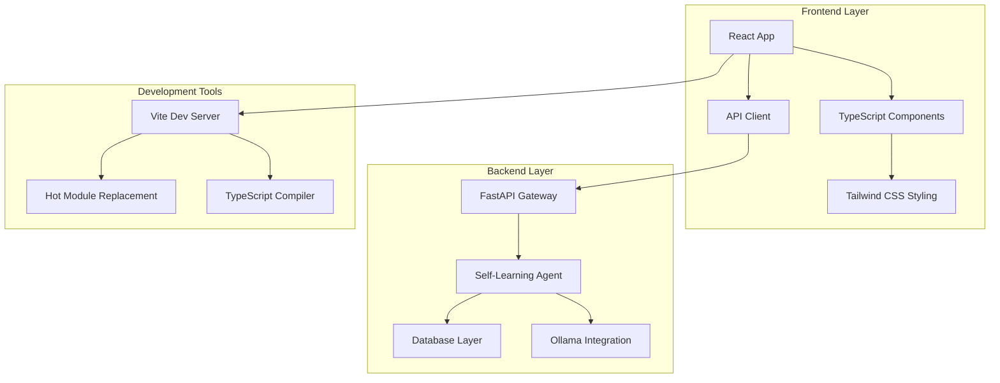

# Design Document

## Overview

This design document outlines the migration from the current Streamlit-based WebUI to a modern React + TypeScript + Tailwind CSS frontend. The new UI will maintain all existing agent communication functionality while providing greater flexibility, better user experience, and improved maintainability. The design follows a clean separation between frontend and backend, utilizing the existing FastAPI gateway for all API communications.

## Architecture

### High-Level Architecture



### Technology Stack

- **Frontend Framework**: React 18 with TypeScript
- **Build Tool**: Vite for fast development and optimized builds
- **Styling**: Tailwind CSS for utility-first styling
- **Icons**: Lucide React icons (fallback to Google Fonts theme icons)
- **Package Manager**: Yarn (as per project rules)
- **API Communication**: Axios or Fetch API for HTTP requests
- **State Management**: React Context API + useReducer for complex state
- **WebSocket**: For real-time streaming responses

### Project Structure

```
frontend/
├── src/
│   ├── components/           # Reusable UI components
│   │   ├── ui/              # Basic UI components (Button, Input, etc.)
│   │   ├── chat/            # Chat-specific components
│   │   ├── sidebar/         # Sidebar components
│   │   └── layout/          # Layout components
│   ├── hooks/               # Custom React hooks
│   ├── services/            # API service layer
│   ├── types/               # TypeScript type definitions
│   ├── utils/               # Utility functions
│   ├── styles/              # Global styles and Tailwind config
│   ├── App.tsx              # Main application component
│   └── main.tsx             # Application entry point
├── public/                  # Static assets
├── package.json             # Dependencies and scripts
├── vite.config.ts           # Vite configuration
├── tailwind.config.js       # Tailwind CSS configuration
└── tsconfig.json            # TypeScript configuration
```

## Components and Interfaces

### Core Components

#### 1. App Component

- **Purpose**: Main application container and routing
- **Responsibilities**:
  - Initialize global state
  - Handle authentication state
  - Manage theme and layout preferences
  - Provide error boundaries

#### 2. ChatInterface Component

- **Purpose**: Main chat interface for user-agent interaction
- **Features**:
  - Message display with streaming support
  - Input field with auto-resize
  - File upload capabilities
  - Message history management
- **Props**: `sessionId`, `onMessageSend`, `messages`

#### 3. Sidebar Component

- **Purpose**: Collapsible sidebar with navigation and settings
- **Features**:
  - Model selection dropdown
  - Agent status display
  - Configuration options
  - Session management
- **Responsive Behavior**:
  - 288px width when expanded
  - 48px width when collapsed
  - Auto-collapse when screen width < 1056px (768px + 288px)

#### 4. MessageBubble Component

- **Purpose**: Individual message display
- **Features**:
  - User/Assistant message differentiation
  - Reasoning section display (collapsible)
  - Timestamp and status indicators
  - Copy to clipboard functionality

#### 5. StreamingText Component

- **Purpose**: Real-time text streaming display
- **Features**:
  - Character-by-character animation
  - Typing indicators
  - Smooth transitions

### API Service Layer

#### ApiClient Class

```typescript
class ApiClient {
  private baseURL: string;
  private headers: Record<string, string>;

  // Chat completions
  async sendMessage(message: string, sessionId?: string): Promise<ChatResponse>;
  async streamMessage(
    message: string,
    sessionId?: string
  ): Promise<ReadableStream>;

  // Model management
  async getAvailableModels(): Promise<ModelInfo[]>;
  async setActiveModel(modelId: string): Promise<void>;

  // Session management
  async createSession(userId?: string): Promise<SessionInfo>;
  async getSession(sessionId: string): Promise<SessionInfo>;

  // System status
  async getSystemStats(): Promise<SystemStats>;
  async getHealthStatus(): Promise<HealthStatus>;
}
```

### State Management

#### Global State Structure

```typescript
interface AppState {
  // Authentication
  user: User | null;
  isAuthenticated: boolean;

  // Chat
  currentSession: SessionInfo | null;
  messages: ChatMessage[];
  isStreaming: boolean;

  // UI
  sidebarCollapsed: boolean;
  theme: "dark" | "light";

  // Agent
  availableModels: ModelInfo[];
  activeModel: string;
  agentStatus: "idle" | "processing" | "error";

  // Settings
  streamingEnabled: boolean;
  temperature: number;
  maxTokens: number;
}
```

## Data Models

### TypeScript Interfaces

#### Chat Models

```typescript
interface ChatMessage {
  id: string;
  role: "user" | "assistant" | "system";
  content: string;
  timestamp: Date;
  reasoning?: string;
  metadata?: Record<string, any>;
}

interface ChatResponse {
  id: string;
  message: ChatMessage;
  usage: TokenUsage;
  processingTime: number;
}

interface StreamChunk {
  id: string;
  content: string;
  isComplete: boolean;
  reasoning?: string;
}
```

#### System Models

```typescript
interface ModelInfo {
  id: string;
  name: string;
  description?: string;
  parameters?: number;
  isAvailable: boolean;
}

interface SessionInfo {
  id: string;
  userId: string;
  name: string;
  createdAt: Date;
  lastActivity: Date;
  messageCount: number;
}

interface SystemStats {
  cpu: {
    usage: number;
    temperature?: number;
  };
  memory: {
    usage: number;
    total: number;
  };
  gpu?: {
    usage: number;
    memory: number;
    temperature?: number;
  };
}
```

## Error Handling

### Error Boundary Strategy

- **Global Error Boundary**: Catches unhandled React errors
- **API Error Handling**: Centralized error handling for API calls
- **Fallback UI**: Graceful degradation when components fail
- **Retry Mechanisms**: Automatic retry for transient failures

### Error Types

```typescript
interface ApiError {
  code: string;
  message: string;
  details?: Record<string, any>;
  retryable: boolean;
}

interface UIError {
  component: string;
  error: Error;
  errorInfo: ErrorInfo;
}
```

## Testing Strategy

### Testing Pyramid

#### Unit Tests (70%)

- **Component Testing**: React Testing Library for component behavior
- **Hook Testing**: Custom hooks with @testing-library/react-hooks
- **Utility Testing**: Pure function testing with Jest
- **API Service Testing**: Mock API responses and error scenarios

#### Integration Tests (20%)

- **API Integration**: Test actual API communication
- **Component Integration**: Test component interactions
- **State Management**: Test complex state transitions

#### End-to-End Tests (10%)

- **User Flows**: Critical user journeys with Playwright
- **Cross-browser Testing**: Ensure compatibility
- **Performance Testing**: Core Web Vitals monitoring

### Test Configuration

```typescript
// jest.config.js
export default {
  testEnvironment: "jsdom",
  setupFilesAfterEnv: ["<rootDir>/src/test/setup.ts"],
  moduleNameMapping: {
    "^@/(.*)$": "<rootDir>/src/$1",
  },
  collectCoverageFrom: ["src/**/*.{ts,tsx}", "!src/**/*.d.ts", "!src/test/**"],
  coverageThreshold: {
    global: {
      branches: 80,
      functions: 80,
      lines: 80,
      statements: 80,
    },
  },
};
```

## Responsive Design

### Breakpoint Strategy

Following the project's breakpoint rules:

- **Desktop (>1056px)**: Full layout with expanded sidebar (288px)
- **Tablet (768px-1056px)**: Collapsed sidebar (48px), main content 768px
- **Mobile (<768px)**: Overlay sidebar, full-width main content

### Layout Implementation

```css
/* Tailwind CSS classes for responsive layout */
.main-container {
  @apply max-w-[768px] mx-auto px-4;
}

.sidebar-expanded {
  @apply w-72; /* 288px */
}

.sidebar-collapsed {
  @apply w-12; /* 48px */
}

@media (max-width: 1056px) {
  .sidebar-expanded {
    @apply w-12; /* Auto-collapse */
  }
}

@media (max-width: 768px) {
  .sidebar {
    @apply fixed inset-y-0 left-0 z-50 transform -translate-x-full transition-transform;
  }

  .sidebar-open {
    @apply translate-x-0;
  }
}
```

## Performance Optimization

### Code Splitting

- **Route-based Splitting**: Lazy load different sections
- **Component Splitting**: Dynamic imports for heavy components
- **Vendor Splitting**: Separate vendor bundles

### Optimization Strategies

- **React.memo**: Prevent unnecessary re-renders
- **useMemo/useCallback**: Memoize expensive calculations
- **Virtual Scrolling**: For large message lists
- **Image Optimization**: Lazy loading and WebP format
- **Bundle Analysis**: Regular bundle size monitoring

## Security Considerations

### Frontend Security

- **XSS Prevention**: Sanitize user inputs and API responses
- **CSRF Protection**: Use proper headers and tokens
- **Content Security Policy**: Restrict resource loading
- **Secure Communication**: HTTPS only in production

### API Security

- **Authentication**: JWT tokens or API keys
- **Rate Limiting**: Prevent abuse
- **Input Validation**: Validate all user inputs
- **Error Handling**: Don't expose sensitive information

## Deployment Integration

### Build Process

```json
{
  "scripts": {
    "dev": "vite",
    "build": "tsc && vite build",
    "preview": "vite preview",
    "test": "jest",
    "test:e2e": "playwright test",
    "lint": "eslint src --ext ts,tsx",
    "type-check": "tsc --noEmit"
  }
}
```

### Docker Integration

The React build will integrate with the existing Docker setup:

```dockerfile
# Multi-stage build for React frontend
FROM node:18-alpine as frontend-builder
WORKDIR /app/frontend
COPY frontend/package.json frontend/yarn.lock ./
RUN yarn install --frozen-lockfile
COPY frontend/ .
RUN yarn build

# Main application container
FROM python:3.11-slim
# ... existing Python setup ...
COPY --from=frontend-builder /app/frontend/dist /app/static
```

### FastAPI Static File Serving

```python
from fastapi.staticfiles import StaticFiles

app.mount("/", StaticFiles(directory="static", html=True), name="static")
```

This design ensures a smooth migration from Streamlit to React while maintaining all existing functionality and providing a foundation for future enhancements.
